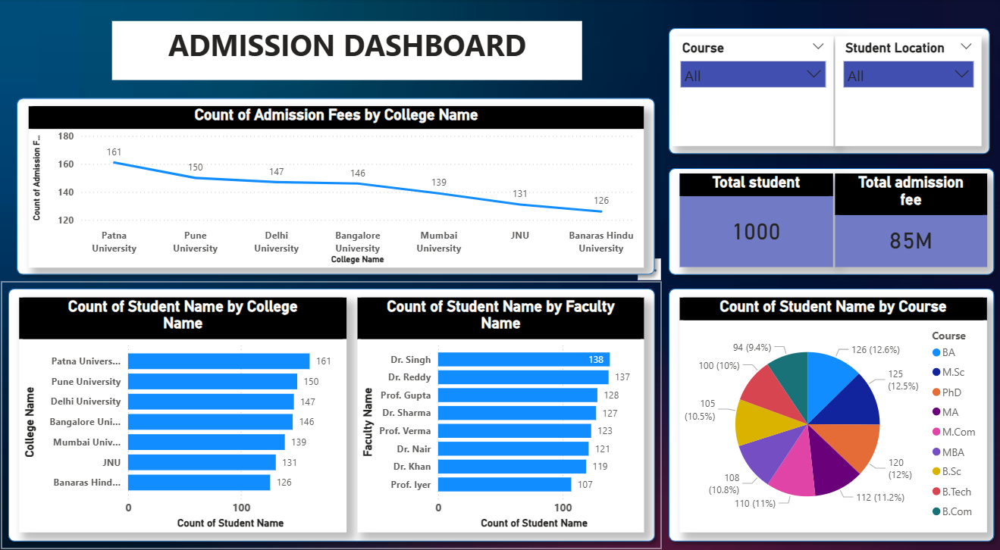

# 🎓 Admission Dashboard — Excel | SQL | Power BI

## 📊 Excel Data Source

The admission dataset was initially prepared and organized in **Microsoft Excel**.  
The Excel data was then used for **SQL analysis** and to build the **Power BI dashboard**.

### Excel Data Includes
- Student Name
- College Name
- Course Name
- Faculty
- Admission Fees
- Student Location

An interactive **Admission Dashboard** built in Microsoft Power BI to analyze student admissions, admission fees, colleges, faculties, courses, and student locations.

## SQL Analysis

The SQL analysis was created to support the Admission Dashboard and extract key insights from the student admission data.

### Key Analysis Performed

- **Total Admissions** – Counted the total number of student admissions.
- **Admission Fees Analysis** – Analyzed admission fee values across the dataset.
- **Admissions by College** – Compared the number of admissions across different colleges.
- **Admissions by Course** – Analyzed admissions based on different courses.
- **Admissions by Student Location** – Examined student distribution by location.
- **College-wise Admission Fees** – Compared admission fee values across colleges.

### SQL Skills Demonstrated

- `SELECT`
- `COUNT()`
- `SUM()`
- `GROUP BY`
- `ORDER BY`
- Aggregate functions
- Filtering and data analysis

The complete SQL queries are available in **[Admission_analysis.sql](Admission_analysis.sql)**.

## 📌 Project Overview

This project transforms admission data into an interactive business dashboard that makes it easier to understand:

- Total number of students admitted
- Total admission fee generated
- Admission fee by college
- Student distribution by college
- Student distribution by faculty
- Student distribution by course
- Filtering by course
- Filtering by student location

The dashboard is designed to provide a quick, visual overview of admission performance and student distribution.

## 🎯 Objectives

1. Monitor overall student admissions.
2. Analyze admission fee performance across colleges.
3. Compare student counts across colleges.
4. Understand student distribution by faculty and course.
5. Explore the data using interactive filters.
6. Present admission data in a recruiter-friendly Power BI portfolio project.

## 📊 Dashboard Features

### KPI Cards
- **Total Student** — overall student count for the selected filters.
- **Total Admission Fee** — total admission fee for the selected filters.

### Visualizations
- **Admission Fees by College Name** — compares admission-fee performance across colleges.
- **Student Name Count by College Name** — compares student volume across colleges.
- **Student Name Count by Faculty Name** — shows student distribution across faculties.
- **Student Name Count by Course** — shows course-wise student distribution.

### Interactive Filters
- **Course**
- **Student Location**

Changing a filter updates the dashboard visuals and KPI cards dynamically.

## 🔍 Key Analysis Areas

### College Performance
The dashboard helps compare colleges based on admission-fee contribution and number of students.

### Faculty Distribution
The faculty chart highlights which faculties have higher student representation.

### Course Distribution
The course visualization provides a quick view of how students are distributed among different courses.

### Location & Course Filtering
Interactive slicers allow users to drill into specific student groups instead of relying only on the overall totals.

## 🛠️ Tools & Technologies

- **Microsoft Power BI**
- **Data Visualization**
- **Interactive Dashboard Design**
- **Data Analysis**
- **Power BI Slicers & KPI Cards**

## 📈 Business Value

This dashboard can help an admission team or management quickly identify:

- Which colleges contribute more admission fees
- Which colleges have higher student volumes
- Which faculties attract more students
- Which courses have stronger student representation
- How results change for different courses or student locations

## 💡 Skills Demonstrated

- Dashboard development in Power BI
- Data visualization
- KPI design
- Interactive filtering
- Comparative analysis
- Business-oriented reporting
- Clean dashboard presentation

## 👤 Author

**Sachita Nand**

This project is part of a data analytics portfolio demonstrating practical skills in Excel, SQL, and Power BI for data analysis and business reporting.
